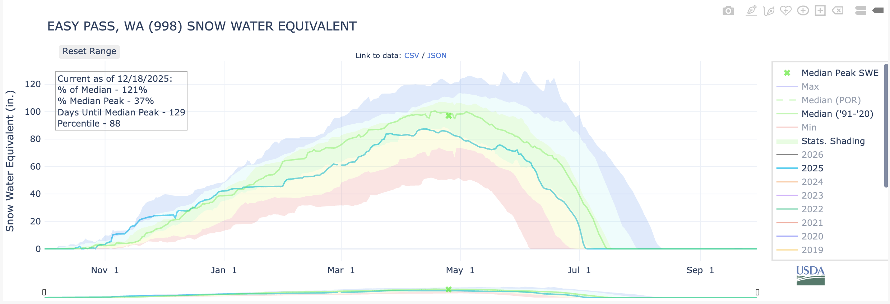

# What Snow Day Is It?
This is a simple online application that uses a location and the current snowpack to determine which day or days it would be during an average year.

The service should operate in two different major modes:

- Snowfall ("SWE" or snow water equivalent).
- Snow depth (depth of snow on the ground).

For minor modes (nested within the major mode):

- Comparison to mean.
- Comparison to median.
- Comparison to specific snow year.

Note that snow years start October 1st, so the "2025 snow year" runs from October 1st, 2024 to September 30th, 2025.

For example, the two relevant human-facing pages for Easy Pass in the North Cascades would be:

- Snowfall (SWE): https://nwcc-apps.sc.egov.usda.gov/awdb/site-plots/POR/WTEQ/WA/Easy%20Pass.html
- Snow depth https://nwcc-apps.sc.egov.usda.gov/awdb/site-plots/POR/SNWD/WA/Easy%20Pass.html

## Baseline Concept in Functional Terms
The concept is a simple composition of functions; I'll give the example for snowfall (SWE).

- Let `SWE_median: [Date] -> Number` be the function that maps the a snow year day to the median SWE for that day.
- Let `SWE_2025: [Date] -> Number` be the function that maps a snow year date (in the 2025-2025 snow year) to the SWE for that day.

Then, the function that describes the snowfall day in the 2025 snow year in terms of the median SWE would be `inverse(SWE_median) o SWE_2025`.

A typical invocation would return *two* dates, one in the first part of the snow year and one in the second part of the snow year.  Both of these dates are informative, although the date closest to the current date is the most relevant. 

### Example
The image below shows the median SWE and 2025 snow year SWE for Easy Pass (998).

From the image, for November 15, 2024, the equivalent days in a median year would be around December 5 or July 5.
